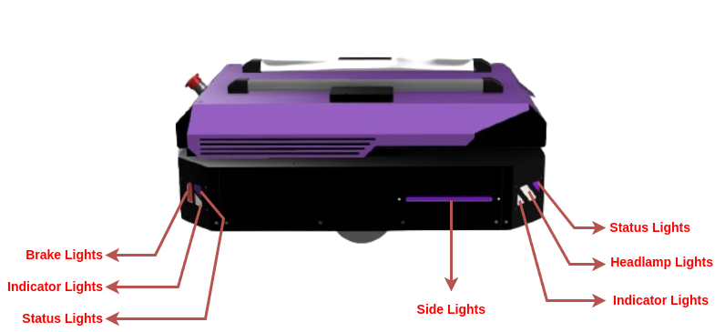
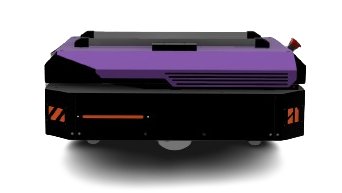
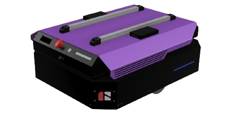
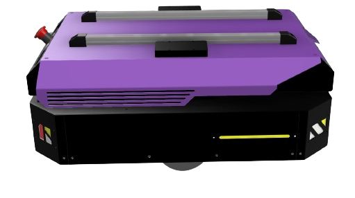
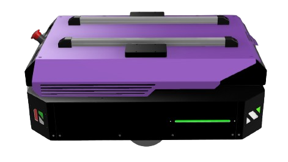
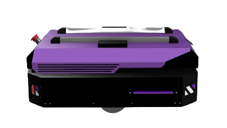
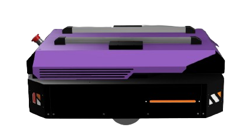
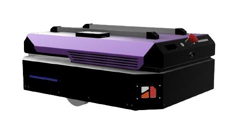
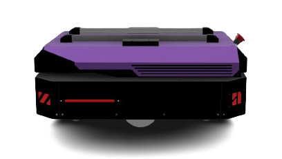

# Acrux ROS2 Humble Release

## 1. Installation

```bash
cd ~/ros2_ws/src  # Assuming ros1_ws is the name of the workspace
```

Clone the repository into your workspace:

```bash
git clone -b ros2-humble https://github.com/rigbetellabs/acrux.git
```

Install dependent packages:

```bash
cd ~/ros2_ws/src/acrux
cat requirements.txt | xargs sudo apt-get install -y 
```

> [!NOTE]
> Check if you already have the ydlidar packages installed; if not, get the packages from repos below.

```bash
cd ~/ros2_ws/src/
https://github.com/rigbetellabs/ydlidar_ros2_driver-humble

```
> [!IMPORTANT]
> In order for Ydlidar package to work, you must have the YDLidar SDK installed on your system. It can be installed via the following procedure:
>```
>git clone https://github.com/YDLIDAR/YDLidar-SDK.git
>sudo apt install cmake pkg-config
>sudo apt-get install python3 swig
>sudo apt-get install python3-pip
>
>mkdir -p YDLidar-SDK/build
>cd YDLidar-SDK/build
>cmake ..
>make
>sudo make install
>
>cd ..
>pip install .
>```


> [!NOTE]
> Custom joystick control script currently runs on the robot, enabling waypoint storage and navigation through joy buttons. This node can be accessed on:

```bash
cd ~/ros1_ws/src/
git clone -b ros2-humble https://github.com/rigbetellabs/joy_with_waypoint_nav.git
```

Build the workspace:

```bash
cd ~/ros1_ws
colcon build --symlink-install
```   
<div style="page-break-after: always;"></div>

## 2. Connection

### Initial Wifi Setup

> [!NOTE]
> By default, the robot is programmed to be started up automatically upon bootup, with its ros running locally without the need for any wifi network.

Follow the steps below to connect the robot to your desired Wifi network
#### 1. Create a mobile hotspot
Initiate a hotspot from your smartphone/laptop with the credentials
- Hotspot Name:  `admin`
- Hotspot Password: `adminadmin`

<p align="center">

</p>

#### 2. Start the robot
Power on the robot and wait until it connects to your hotspot network

| On powering on:            | When connected to hotspot:                               | 
|--------------------|---------------------------------------------|
|    |    |

#### 3. SSH into the robot

- Connect your laptop/remote device to the same hotspot
<p align="center">

</p>

- Open a new terminal, and enter the SSH credentials
```bash
ssh "your-robot-name"@"your-robot-ip"  
pwd: "your-robot-password"
```
> [!TIP]
> The robot name and password have been provided to you while deployment, they have also been marked on the PC present inside the robot. IP can be seen on the display of robot once connected


| Method1           | Method2                            | 
|--------------------|---------------------------------------------|
|    |     |

#### 4. Connect to Wifi

- Enter the following command on the ssh terminal to check available networks
```bash
sudo nmcli dev wifi list --rescan yes
```
 

- Connect to your wifi network
```bash
sudo nmcli device wifi connect "your-wifi-name" password "your-wifi-password"
```
 

> [!IMPORTANT]
> This will close the ssh pipeline and no response will be recieved over it further. Wait for about 30 seconds for robot to be connected to your wifi, once connected it will show the wifi name along with the IP address on the robot display.

<div style="page-break-after: always;"></div>

#### 4. SSH using your Wifi
- Now the robot is connected to your Wifi network! You can now shutdown your mobile hotspot, connect your remove device to the same wifi and access the robot using SSH:

 

<div style="page-break-after: always;"></div>

## 3. NUC Instructions
### Instructions to remove Intel NUC from robot

| Step1               | Step2                                 | Step3                   |
|--------------------|---------------------------------------------|-----------------------------------|
|    |    |       |

(If the above Gifs do not work in your documentation format, you can refer to this [link](https://youtu.be/-I9eqPhfBqA?si=ZTHeQBfnzq4X63mW))

<div style="page-break-after: always;"></div>

### USB ports Configuration
> [!IMPORTANT]
> Connect the USB ports as per the following diagram:


<div style="page-break-after: always;"></div>

## 4. Package Description

### 4.1 acrux_bringup

| Launch File Name       | Description                                                                                                                                                                                                                     |
|------------------------|---------------------------------------------------------------------------------------------------------------------------------------------------------------------------------------------------------------------------------|
| [autobringup.launch.py](https://github.com/rigbetellabs/acrux/blob/ros2-humble/acrux_bringup/launch/autobringup.launch.py)   | Launches the whole autonomous suite, including navigation, exploration, localization, LiDAR packages, RealSense packages, MicroROS(launched separately), simulation, state publisher, RViz, and Hubble scripts.                                 |
| [bringup.launch.py](https://github.com/rigbetellabs/acrux/blob/ros2-humble/acrux_bringup/launch/bringup.launch.py)       | Brings up all the sensors and hardware components on the robot, MicroROS(launched separately), LiDAR, RealSense, and Hubble scripts.                                                                                                    |

### 4.2 acrux_description

| Launch File Name          | Description                                                                                                                                                                                                                      | Nodes Launched                                                                            |
|---------------------------|----------------------------------------------------------------------------------------------------------------------------------------------------------------------------------------------------------------------------------|-------------------------------------------------------------------------------------------|
| [display.launch.py](https://github.com/rigbetellabs/acrux/blob/ros2-humble/acrux_description/launch/display.launch.py)         | Launches Gazebo simulation with all necessary plugins and state publishers, along with RViz.                                                                                                                                     | robot_state_publisher, joint_state_publisher, rviz2, gazebo_ros                     |
|[rviz.launch.py](https://github.com/rigbetellabs/acrux/blob/ros2-humble/acrux_description/launch/rviz.launch.py)           | Launches RViz2 with necessary configuration.                                                                                                                                                                                      | rviz2 with configured settings                                                         |
| [state_publisher.launch.py](https://github.com/rigbetellabs/acrux/blob/ros2-humble/acrux_description/launch/state_publisher.launch.py) | Launches state publishers for the robot, including robot_state_publisher and joint_state_publisher nodes.                                                                                                                                                                                         | robot_state_publisher, joint_state_publisher                                            |


### 4.2 acrux_firmware

Provides sensor and actuation topics. 


| Launch File Name         | Description                                                                                                                                                                                              | Nodes Launched                              |
|--------------------------|----------------------------------------------------------------------------------------------------------------------------------------------------------------------------------------------------------|--------------------------------------------|
| [auto_joy_teleop.launch.py](https://github.com/rigbetellabs/acrux/blob/ros2-humble/acrux_firmware/launch/auto_joy_teleop.launch.py) | Launches the joy node and auto joy node for complete joystick and waypoint-based control of the robot using a joystick.                                                                                  | joy_node, auto_joy_teleop                   |
| [hubble_scripts.launch.py](https://github.com/rigbetellabs/acrux/blob/ros2-humble/acrux_firmware/launch/hubble_scripts.launch.py)  | Provides feedback to the controller about network data and navigation data, including network_pub node and goal_status_publisher node.                                                              | network_publisher (freezed binaries), goal_status_publisher (freezed binaries) |
| [merge_scan.launch.py](https://github.com/rigbetellabs/acrux/blob/ros2-humble/acrux_firmware/launch/merge_scan.launch.py)     | Takes point cloud data from depth camera, converts it to laser scan, and merges it with lidar scan data to provide merged scan data. Uses pointcloud_to_laserscan and ira_laser_tools node. | pointcloud_to_laserscan_node, ira_laser_tools_node |
| [realsense_d435i.launch.py](https://github.com/rigbetellabs/acrux/blob/ros2-humble/acrux_firmware/launch/realsense_d435i.launch.py)   | Launches ROS 2 Realsense packages with point cloud enabling.                                                                                                                                             | ROS 2 Realsense packages                  |


### 4.3 acrux_gazebo
Simulation environment for acrux in Gazebo.

| Launch File Name     | Description                                                                                                               | Nodes Launched                                           |
|----------------------|---------------------------------------------------------------------------------------------------------------------------|----------------------------------------------------------|
|  [gazebo.launch.py](https://github.com/rigbetellabs/acrux/blob/ros2-humble/acrux_gazebo/launch/gazebo.launch.py)      | Launches a Gazebo environment with a specified world, along with the gazebo_ros node.                                    | gazebo_ros node                                         |
|  [spawn_robot.launch.py](https://github.com/rigbetellabs/acrux/blob/ros2-humble/acrux_gazebo/launch/spawn_robot.launch.py) | Launches a Gazebo environment with a specified world and spawns the robot with necessary plugins using gazebo_ros node. | gazebo_ros node, robot_state_publisher, joint_state_publisher, gazebo_controllers |

### 4.4 acrux_navigation
Autonomous navigation of the robot using `Nav2` in a known as well as an unknown environment.

| Launch File Name   | Description                                                                                                                                                   | Nodes Launched |
|--------------------|---------------------------------------------------------------------------------------------------------------------------------------------------------------|----------------|
| [navigation.launch.py](https://github.com/rigbetellabs/acrux/blob/ros2-humble/acrux_navigation/launch/navigation.launch.py)| Launches all the necessary nodes for Nav2-based robot navigation with the necessary parameters for the specified robot.                                 | Nav2 navigation nodes (e.g., planner, controller, recovery nodes) with specified parameters. |
| [map_saver.launch.py](https://github.com/rigbetellabs/acrux/blob/ros2-humble/acrux_navigation/launch/map_saver.launch.py) | Saves the map created during exploration mode to the maps directory.                                                                                        | map_saver node |


### 4.6 acrux_slam
Simultaneous Localization and Mapping (SLAM) for the robot.

| Launch File Name       | Description                                                                                                                             | Nodes Launched                           |
|------------------------|-----------------------------------------------------------------------------------------------------------------------------------------|------------------------------------------|
| [cartographer.launch.py](https://github.com/rigbetellabs/acrux/blob/ros2-humble/acrux_slam/launch/cartographer.launch.py)  | Launches the Cartographer node for SLAM and localization tasks.                                                                         | Cartographer node                        |
| [slam_toolbox.launch.py](https://github.com/rigbetellabs/acrux/blob/ros2-humble/acrux_slam/launch/slam_toolbox.launch.py)  | Launches the SLAM Toolbox for performing SLAM in unknown environments.                                                                  | SLAM Toolbox node                       |

<div style="page-break-after: always;"></div>

## 5. Launch Sequence
> [!NOTE]
> By default, the robot is programmed to be started up automatically upon bootup, with its ros running locally without the need for any wifi network. To get into the development mode of the robot, ssh into the robot and run
```bash
cd ~/ros2_ws/src/acrux
./development.sh
```
This will stop all your local ros servers permanently and allow you to test your launch files according to will. If you need the robot to be upstart upon bootup again, you can always enable it using
```bash
cd ~/ros2_ws/src/acrux
./demo.sh
```


### Simulation

```bash
ros2 launch acrux_gazebo spawn_robot.launch.py
```
The gazebo world looks like this:
Add links for other launch files following the same pattern as display.launch.


<div style="page-break-after: always;"></div>

### Real Robot

For complete startup of the robot with all its features and autonomous navigation:

```bash
ros2 launch acrux_bringup autobringup.launch  
```
Other Arguments to play with:

| Argument      | Description                                                                                                                                                   | Default Value |
|---------------|---------------------------------------------------------------------------------------------------------------------------------------------------------------|---------------|
| use_sim_time  | Set to True for Gazebo simulation, False for real robot.                                                                                                     | False         |
| joy           | Set to True to enable joystick control.                                                                                                                      | True          |
| map_file      | Provide the directory path to launch the robot on a specified map (works only when exploration is set to False).                                             | None          |
| exploration   | Set to True for SLAM and false for map-based navigation.                                                                                                      | True          |
| realsense     | Set to True to launch the RealSense camera.                                                                                                                   | True          |
| merge_scan    | Set to True to merge the RealSense and LiDAR data to get a merged scan topic that can be used for navigation and other purposes.                           | False         |

To launch only sensors and actuators without navigation and odometry:
```bash
ros2 launch acrux_bringup bringup.launch joy:=True #set to true for joystick control
```

### 5.1 SLAM and map saver
```bash
ros2 launch acrux_bringup autobringup.launch exploration:=True
```
#### This will ensure all the necessary nodes are up for SLAM based navigation on the robot. 

<div style="page-break-after: always;"></div>

To save the map:

```bash
ros2 launch acrux_navigation map_saver.launch.py map_file_path:=/your/map/directory

```

### 5.2 Autonomous Navigation in the Saved Map

```bash
ros2 launch acrux_bringup autobringup.launch exploration:=False map_file:=/your/map/directory
```

> [!NOTE]
> Upon powering on the robot you'll be able to see the bootup animation on the robot

 
<!--  -->

> [!NOTE]
> Once the robot is booted up and bringup.launch is initiated, you'll get to see the robot transition to READY mode

<!--   -->


<div style="page-break-after: always;"></div>

## 6. Low-Level ROS Topics

#### `/battery/percentage`
This topic provides information about the remaining battery percentage of the robot. 

| Battery Percentage  | Beeping Sounds              |
|----------------------|-----------------------------|
| 100 - 20            | No beeping                  |
| 20 - 15              | Beep every 2 minutes        |
| 15 - 10              | Beep every 1 minute        |
| Below 10             | Very frequent beeping      |
| 0 (Complete Discharge)| Continuous beep             |

> [!TIP]
> To ensure you are aware of the robot's battery status, pay attention to the beeping sounds, especially as the battery percentage decreases.

> [!CAUTION]
> Do not drain the battery below `10 %`, doing so can damage the battery permanently.

#### `/battery/voltage`
This topic reports the current battery voltage, ranging from 25.2V at maximum charge to 19.8V at minimum charge.

#### `/cmd_vel`
The `/cmd_vel` topic is responsible for receiving velocity commands for the robot. These commands can be generated by teleoperation or the `move_base` module, instructing the robot on how fast to move in different directions.

#### `/pid/control`
This topic is of type `int` and is used to control the Proportional-Integral-Derivative (PID) controller. Publishing `0` stops PID control, `1` starts fast PID control, `2` activates smooth PID control, `3` activate supersmooth PID control.
Here's an example:
```bash
ros2 topic pub -1 /pid/control std_msgs/msg/Int32 data:\ 1\ 

```
#### `/diagnostics/test`
The `/diagnostics/test` topic is utilized to run diagnostics on the robot. It serves the purpose of identifying and addressing any issues that may arise during the robot's operation. For detailed diagnostics procedures, refer to the documentation.

#### `/wheel/ticks`
This topic provides an array of ticks for all four wheels of the robot, in the format `[lf, lb, rf, rb]`. These values represent the encoder readings of the wheel ticks.

#### `/wheel/vel`
The `/wheel/vel` topic sends an array of calculated velocities for each wheel on the robot, received via encoders. The format of the array is `[lf, lb, rf, rb]`, representing the actual velocity at which each wheel is moving.

<div style="page-break-after: always;"></div>

## 7. acrux Robot Parameters

| Parameter                   | Value                                     |
|-----------------------------|-------------------------------------------|
| **Wheels Type**             | Differential Wheels                       |
| **Diameter**                | 0.1m                                      |
| **Wheel Separation**        | 0.5m                                      |
| **Motor Type**              | Planetary DC Geared Motor                 |
| **RPM**                     | 100                                       |
| **Encoder Type**            | Magnetic Encoder                          |
| **PPR (Pulses Per Revolution)**| 498                                      |
| **Microcontroller**         | DOIT-ESP32 Devkit V1                      |
| **PC Used**                 | Intel NUC i3 10th Gen                     |
| **Robot Payload Capacity**  | 100 kgs                                   |
| **Battery Life**            | About 3 hours                             |
| **Battery Type**            | Lithium-ion 6-cell, 22.2V                 |

<!-- ## 8. Diagnostic Tests

### Overview

The diagnostic tests are designed to ensure the proper functioning of various components of the acrux robot. These tests cover motor and encoder connections, motor direction, IMU connections, display connections, and a comprehensive full diagnostic test.

### Instructions

Here is a table summarizing the instructions for each diagnostic test:

| Test Number | Test Type                    |
|-------------|------------------------------|
| 0           | Full Diagnostic Test         |
| 1           | Motor and Encoder Test       |
| 2           | Motor Direction Test         |
| 3           | IMU Connections Test         |
| 4           | Display Connections Test     |

### Detailed Instructions

1. **Full Diagnostic Test (Test Number: 0):**
   - Run the full diagnostic test to check the overall health of the robot.

2. **Motor and Encoder Test (Test Number: 1):**
   - Check motor and encoder connections.

3. **Motor Direction Test (Test Number: 2):**
   - Verify motor direction.

4. **IMU Connections Test (Test Number: 3):**
   - Validate IMU (Inertial Measurement Unit) connections.

5. **Display Connections Test (Test Number: 4):**
   - Confirm proper connections with the display.

### How to Run Diagnostics

To run the diagnostic tests, follow these steps:

1. On your acrux terminal, launch the `bringup.launch` file:
   ```bash
   ros2 launch acrux_firmware bringup.launch
   ```

2. On your slave PC or another terminal of your acrux, run the diagnostics test script:
   ```bash
   python3 diagnostics_test.py
   ```

3. The script will guide you through the instructions for each diagnostic test. Follow the on-screen instructions carefully. 

### Important Notes
- It is crucial to execute the tests with caution and follow the on-screen instructions for each test to ensure accurate results.
- Ensure that the robot has sufficient space to move during the motor direction test (Test Number: 2).
- If any issues are identified during the tests, refer to the specific diagnostic output for guidance on addressing the problem.

By following these instructions, you can perform diagnostic tests on the acrux robot to identify and resolve any issues with its components.
-->
<div style="page-break-after: always;"></div>

## 9. Joystick Control Instructions


<div style="page-break-after: always;"></div>

## 10. LED indicators instructions

### Nomenclature



------

### Instructions
1. 
<p align="center">


| Indication type             | Indicates            |
|-----------------------------|----------------------|
| All orange fading effect    | ROS not connected    |

</p>

------
<div style="page-break-after: always;"></div>

2. 
<p align="center">


| Indication type             | Indicates            |
|-----------------------------|----------------------|
| Blue Sidelights, White Headlights, Red Brakelights | ROS Connected     |

</p>

------

3. 
<p align="center">


| Indication type             | Indicates            |
|-----------------------------|----------------------|
| Yellow Status/Side lights + beep 1 | Way towards goal     |

</p>

------
<div style="page-break-after: always;"></div>

4. 
<p align="center">


| Indication type             | Indicates            |
|-----------------------------|----------------------|
| Green Status/Side lights flash thrice with buzzer | Goal Reached     |

</p>

------

5. 
<p align="center">


| Indication type             | Indicates            |
|-----------------------------|----------------------|
| Purple Status/Side lights with beep once | Goal location stored     |

</p>

------
<div style="page-break-after: always;"></div>

6. 
<p align="center">


| Indication type             | Indicates            |
|-----------------------------|----------------------|
| Orange Status/Side lights   | Clear costmap    |

</p>

------

7. 
<p align="center">


| Indication type             | Indicates            |
|-----------------------------|----------------------|
| Orange blinking indicator lights | Direction of robot travel     |

</p>

------
<div style="page-break-after: always;"></div>

8. 
<p align="center">


| Indication type             | Indicates            |
|-----------------------------|----------------------|
| Red Status/Side lights  | Cancel Goal/ Mission Abort    |

</p>

------

9. 
<p align="center">


| Indication type             | Indicates            |
|-----------------------------|----------------------|
| All Red lights | Emergency button pressed    |

</p>


